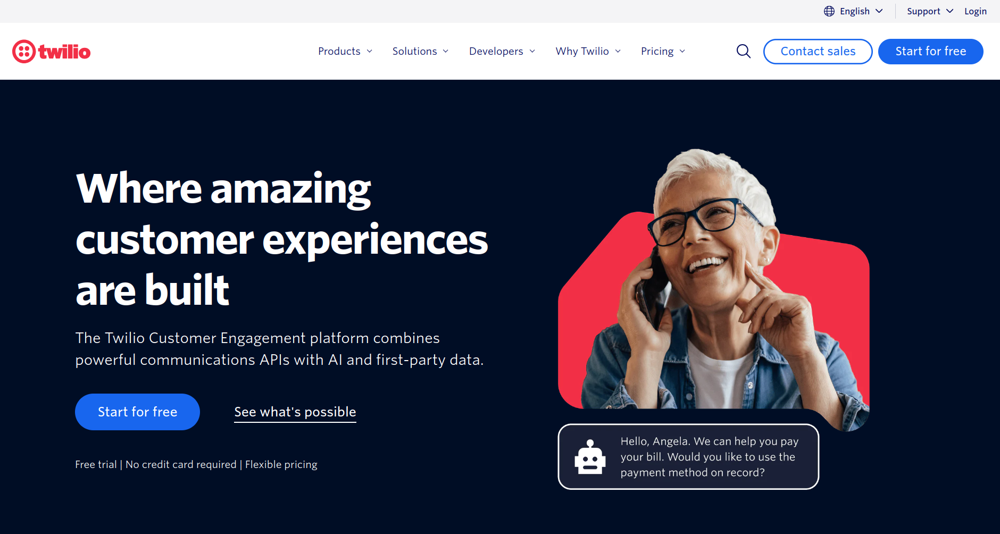
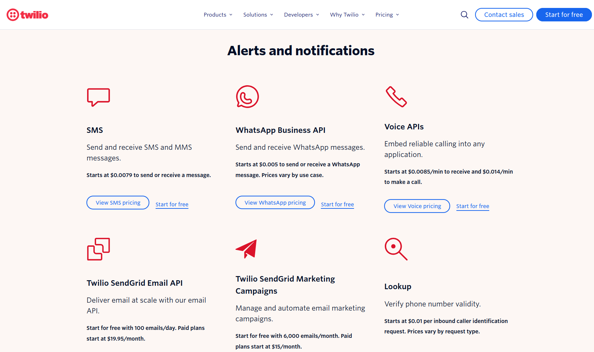

You've probably come across a landing page which looks something like this:

It is very hard to tell, from its landing page, what [Twilio](https://twilio.com) actually does.
What exactly does it mean that they'll "combine powerful communications APIs with AI and first-party data?"
I certainly don't know.

In these situations, I find that
the easiest way to tell what the company does is to
skip the landing page entirely and read the pricing page instead.
Usually these pages will give you a breakdown of
the features you actually care about, along with how much they cost.
On the pricing page, the company has to talk about how much you pay and typically _what you get for it in return_.

For example, here's the pricing page linked from the Twilio landing page shown above:

Clear and concise descriptions of each of their products, along with prices.
This pattern holds for the majority of B2B companies' websites,
so the next time your eyes glaze over reading meaningless corporate-speak,
consider looking at the pricing.
